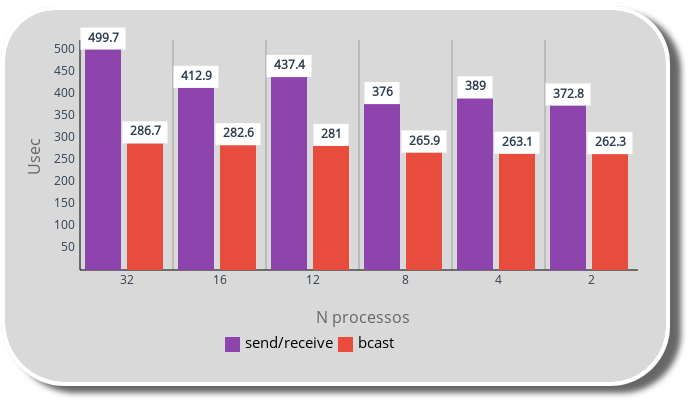
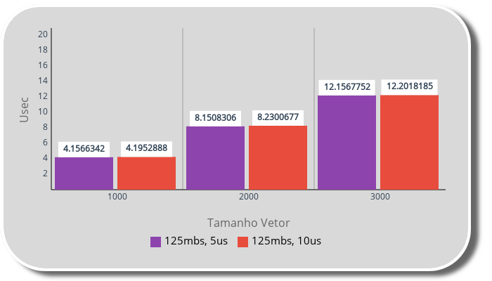
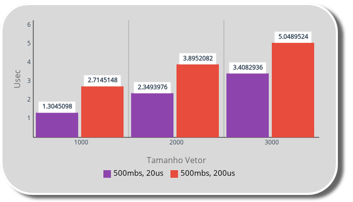

[Programação Paralela](https://github.com/AndreaInfUFSM/elc139-2019a) > T7

# Avaliação de desempenho de programas MPI

Nome: Gabriel Doyle Balk
 
[Configuração](https://github.com/doyleSM/elc139-2019a/blob/master/trabalhos/t2/specs.txt) da maquina utilizada  
 

# Parte 1

[Minha implementação](sr_meu_bcast.c) com MPI_Bcast
 
[Implementação original](sr_bcast.c) do programa
 
 

 
Os parâmetros do xml originais não foram alterados,largura de banda de 125Mbps, e latência de 5us, e speed host de 14GFlops conforme a [lista](https://setiathome.berkeley.edu/cpu_list.php) de performance fornecida.

Abaixo a tabela com os resultados obtidos:

| tool         | ntasks | host-speed | usec  |
| ------------ | ------ | ---------- | ----- |
| send/receive | 2      | 14GFlops   | 372.8 |
| send/receive | 4      | 14GFlops   | 389   |
| send/receive | 8      | 14GFlops   | 376   |
| send/receive | 12     | 14GFlops   | 437.4 |
| send/receive | 16     | 14GFlops   | 412.9 |
| send/receive | 32     | 14GFlops   | 499.7 |
| Bcast        | 2      | 14GFlops   | 262.3 |
| Bcast        | 4      | 14GFlops   | 263.1 |
| Bcast        | 8      | 14GFlops   | 265.9 |
| Bcast        | 12     | 14GFlops   | 281   |
| Bcast        | 16     | 14GFlops   | 282.6 |
| Bcast        | 32     | 14GFlops   | 286.7 |

 

# Parte 2

**Desempenho do [programa](avg.c) fornecido**

 

# Gráficos:

 

 

Speed host de 14GFlops conforme a [lista](https://setiathome.berkeley.edu/cpu_list.php) de performance fornecida.

Abaixo a tabela com os resultados obtidos:

| ntasks | host-speed | largura banda | latência | usec       | vetor |
| ------ | ---------- | ------------- | -------- | ---------- | ----- |
| 16     | 14GFlops   | 125mbs        | 5us      | 4.1566342  | 1000  |
| 16     | 14GFlops   | 125mbs        | 5us      | 8.1508306  | 2000  |
| 16     | 14GFlops   | 125mbs        | 5us      | 12.1567752 | 3000  |
| 16     | 14GFlops   | 125mbs        | 10us     | 4.1952888  | 1000  |
| 16     | 14GFlops   | 125mbs        | 10us     | 8.2300677  | 2000  |
| 16     | 14GFlops   | 125mbs        | 10us     | 12.2018185 | 3000  |

 

 

Speed host de 14GFlops conforme a [lista](https://setiathome.berkeley.edu/cpu_list.php) de performance fornecida.

 

Abaixo a tabela com os resultados obtidos:

| ntasks | host-speed | largura banda | latência | usec      | vetor |
| ------ | ---------- | ------------- | -------- | --------- | ----- |
| 16     | 14GFlops   | 500mbs        | 20us     | 1.3045098 | 1000  |
| 16     | 14GFlops   | 500mbs        | 20us     | 2.3493976 | 2000  |
| 16     | 14GFlops   | 500mbs        | 20us     | 3.4082936 | 3000  |
| 16     | 14GFlops   | 500mbs        | 200us    | 2.7145148 | 1000  |
| 16     | 14GFlops   | 500mbs        | 200us    | 3.8952082 | 2000  |
| 16     | 14GFlops   | 500mbs        | 200us    | 5.0489524 | 3000  |

# Referências

- [MPI: A Message-Passing Interface Standard](https://www.mpi-forum.org/docs/mpi-3.1/mpi31-report.pdf)
- [SMPI CourseWare](https://simgrid.github.io/SMPI_CourseWare/)
- [Exemplos de comunicação](exemplos/)
